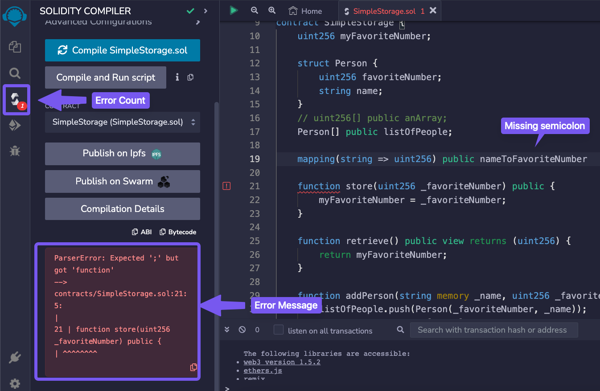
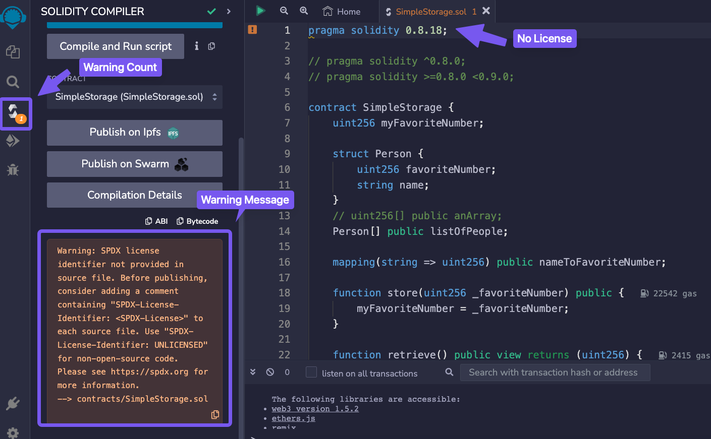
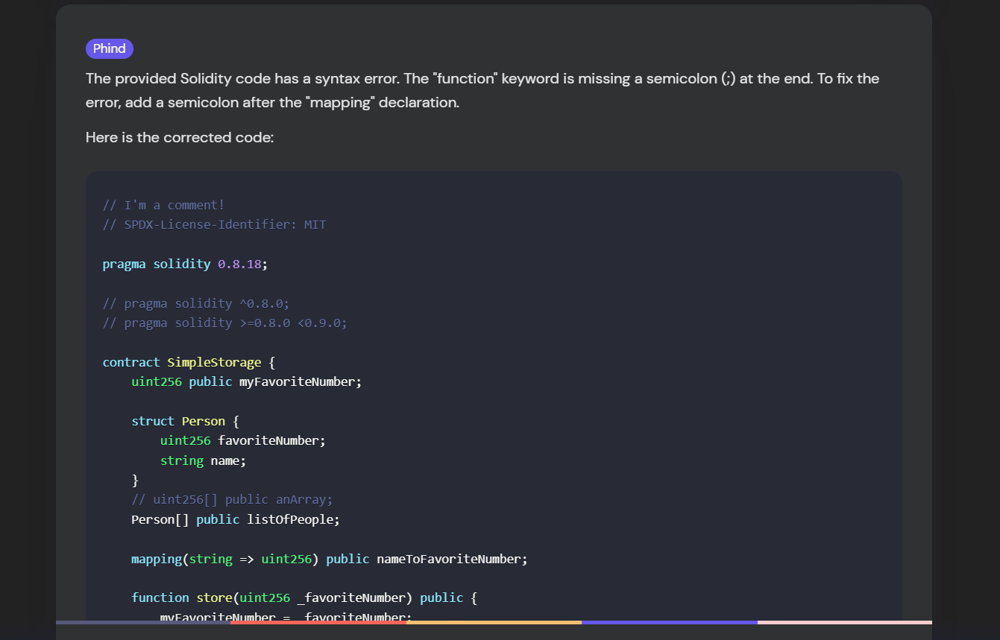

### Introduction

In the previous lesson, we learned how to combine *arrays* and *structs* to store information and how to manipulate this information with the function `addPerson`. This time we'll explore **errors** and **warnings** and how to leverage forums, search engines and AI resources.

### Errors and Warnings

If we remove a semicolon from the code and then try to compile it, you'll encounter some error messages. They will prevent the compiler from converting the code into a machine-readable form.



Restoring the semicolon to its correct position will prevent any errors, enabling us to proceed with deploying the code to the Remix VM.

On the other hand, if we delete the SPDX License Identifier from the top of our code and recompile, we will receive a yellow box showing a warning.

> **WARNING:** SPDX license identifier not provided in source file



Unlike errors, **warnings** allow the code to be compiled and deployed but it's wise to take them seriously and aim to remove them entirely. They point out poor or risky practices in your code and sometimes indicate potential bugs. 

* If it's *red*, there is a compilation error in the code and it needs to be solved before deployment.
* If it's *yellow*, you might want to double-check and adjust your code.

### Leverage your resources

In situations when you do not understand the error that's prompted, using some online resources can make the situation clearer:

* AI Frens (ChatGPT, Phind, Gemini, AI Chrome extensions, ...)
* Github Discussions
* Stack Exchange Ethereum
* Peeranha

### Phind

Let's now attempt to resolve the semicolon error we intentionally created before by using Phind. Phind is an AI-powered search engine for developers. It operates by first conducting a Google search based on your query, and then parsing the results to give you a contextual response.

We can input the compiler error under the drop-down menu, execute the search, and get a comprehensive explanation of why the error happened and how to fix it.



### Other resources

It is advised to make active use of AI tools, as they can substantially boost your understanding and skills. Later in this course, we will explore how to ask effective questions, utilize AI prompts, structure your inquiries, and improve your search and learning techniques.

You can also take part of online communities like **GitHub discussions** and **Stack Exchange**, where you'll find valuable insights, answers to your questions, and support form fellow developers.

> **TIP:** \
One of the most important aspects of being an excellent software engineer or prompt engineer is not just having the information but knowing where to find it.

### Conclusion

You've just learned how to effectively identify and manage errors and warnings, enhancing your ability to maintain robust and reliable code. In the following lesson, we will delve deeper into Solidity's data locations and some advanced Remix functionalities.

### Test yourself

1. What's the difference between a warning and an error? Make an example of each.
   * Warnings allow the code to be compiled and deployed but they point out poor or risky practices in your code and sometimes indicate potential bugs
      * ```solidity
        function unusedVariable() public pure returns (uint) {
            uint x = 10; // WARNING: unused variable
            return 5;
        }
        ```
   * Errors prevent the compiler from converting the code into machine-readable form (copmilation) and will not deploy.
      * ```solidity
        function bad() public pure returns (uint) {
            return x; // ERROR: x is not defined
        }
        ```
2. Make a written list (or a bookmark in your browser) with at least 3 useful online resources will help you solve future bugs.
   * Soldiity Documentation
   * Remix IDE
   * Etherscan
   * ChatGPT / Claude