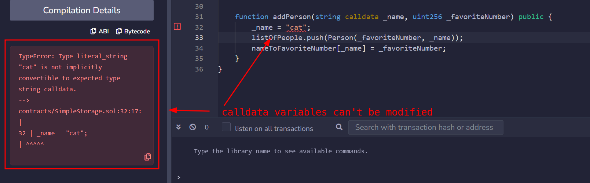
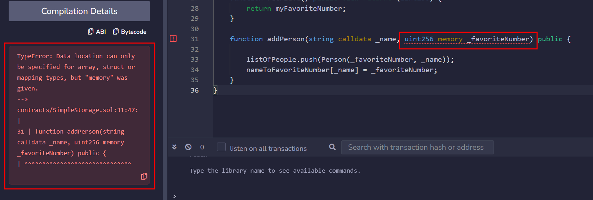

### Introduction

In this section, we will explore how Solidity manages data storage, focusing on the differences between storage, memory, and calldata, and why these concepts are crucial for writing optimized and secure smart contracts.

### Data Locations

Solidity can store data in **six** different locations. In this lesson, we will focus on the first three:

1. **Calldata**
2. **Memory**
3. **Storage**
4. Stack
5. Code
6. Logs

### Calldata and Memory

In Solidity, `calldata` and `memory` are temporary storage locations for variables during function execution. `calldata` is read-only, used for function inputs that can't be modified. In contrast, `memory` allows for read-write access, letting variables be changed within the function. To modify `calldata` variables, they must first be loaded into `memory`.

> **WARNING:**\
Most variable types default to a non-storage location automatically (like memory, the stack, etc). However, for strings, you must specify either memory, calldata, or storage due to the way arrays are handled in memory.

```solidity
string memory variableName = "someValue";
```

### Calldata

Calldata variables are read-only and cheaper than memory. They are mostly used for input parameters.

In the following example, if we try to replace the keyword `memory` with `calldata`, we receive an error because `calldata` variables can't be manipulated.

```solidity
function addPerson(string calldata _name, uint256 _favoriteNumber) public {
    _name = "cat";
    listOfPeople.push(Person(_favoriteNumber, _name));
}
```



### Storage

Variables stored in `storage` are persistent on the blochchain, retaining their values between function calls and transactions.

In our contract, the variable `myFavoriteNumber` is a storage variable. Variables which are declared outside any function are implicitly converted to storage variables.

```solidity
contract MyContract {
    uint256 favoriteNumber; // this is a storage variable
}
```

### Strings and primitive types

If you try to specify the `memory` keyword for an `uint256` variable, you'll encounter this error:

> Data location can only be specified for array, struct, or mapping type



In Solidity, a `string` is recognized as an **array of bytes**. On the other hand, primitive types, like `uint256` have built-in mechanisms that dictate how and where they are stored, accessed and manipulated.

> **WARNING:**\
You can't use the `storage` keyword for variables inside a function. Only `memory` and `calldata` are allowed here, as the variable only exists temporarily.

```solidity
function addPerson(string memory _name, uint256 _favoriteNumber) public {  // cannot use storage as input parameters
    uint256 test = 0; // variable here can be stored in memory or stack
    listOfPeople.push(Person(_favoriteNumber, _name));
}
```

### Conclusion

Well done! You've learned the differences between the keywords storage, memory, and calldata in Solidity, enhancing your skills to develop robust Ethereum-based applications.

### Test yourself

1. How does the Solidity compiler handle primitive types and strings in terms of memory management?
   * Primitive types are stored directly as values and typically occupy one 32-byte slot in memory or storage
   * `String` is a dynamic reference type, similar to `bytes`. It stores data separately from the variable reference. It must also specify a data location 
      * `storage` (persistent)
      * `memory` (temporary)
      * `calldata` (read-only, external inputs)
2. Why can't the storage keyword be used for variables inside a function?
    * You cannot declare new local variables with `storage`. You can only create references to existing storage variables.
3. Write a smart contract that uses storage, memory and calldata keywords for its variables.
   * ```solidity
     // SPDX-License-Identifier: MIT
     pragma solidity ^0.8.19;

     contract StorageMemoryCalldataExample {

        string public storedText = "Hello";

        function example(string memory _input1, string calldata _input2) external view returns (string memory, string memory, string memory) {
            // storage reference (points to state variable)
            string storage storageRef = storedText;

            // memory variable (temporary copy) 
            string memory memoryVar = _input1;

            // calldata variable (read-only input)
            string calldata calldataVar = _input2;

            return (storageRef, memoryVar, calldataVar);
        }

     }
     ```