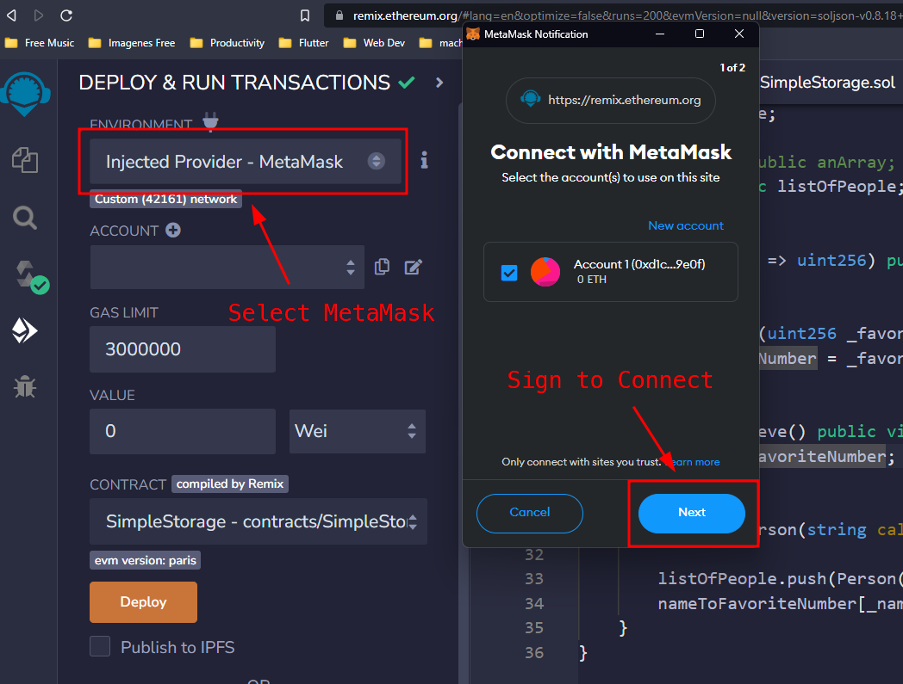
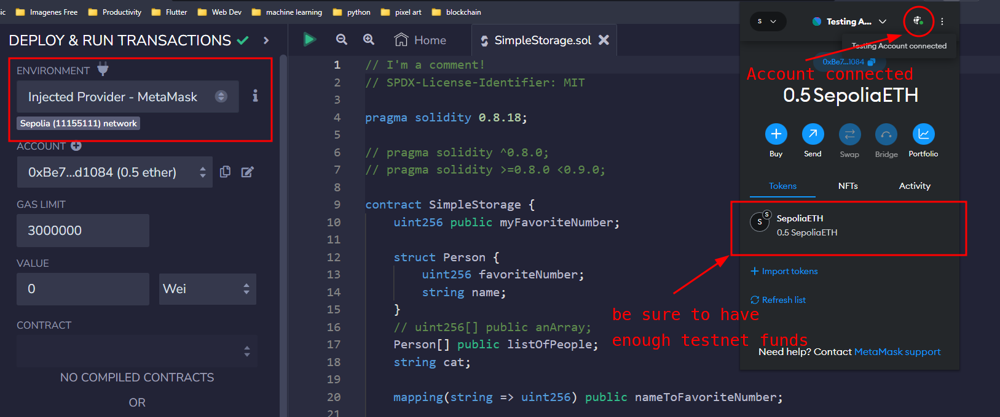

### Introduction

Over the past eight lessons, we crafted the `SimpleStorage` contract. It defines a custom type `Person`, includes an internal variable that can be read and updated, and contains a public array and mapping that can also be modified. In this lesson, we will deploy the contract to a **real testnet**, which fully simulates a live blockchain environment without using real Ether.

> **CAUTION:**\
You could be tempted to immediately deploy this contract to the mainnet. As a general rule, I caution against this. Make sure to write tests, carry out audits and ensure the robustness of your contract before deploying it to production. However, for the sake of this demonstration, we're going to deploy this as a dummy contract on a testnet.

Before deploying, be always sure to make a **compilation check**. This ensures that the contract has no errors or warnings, and is fit for deployment.

### Deployment on a testnet

We can start the deployment process by going into the deployment tab and switching from the local vritual environment (Remix VM) to the Injected Provider - MetaMask. This action will allow Remix to send requests and interact with your MetaMask account.

You will be then prompted to select an account from your MetaMask wallet. Once you've connected that account to Remix, you should see a confirmation that the account is properly linked and that you are using the Sepolia testnet.

Ensure you have enough Sepolia ETH in your account, which you can obtain from a [faucet](https://www.alchemy.com/faucets/ethereum-sepolia). Once your balance is sufficient, you can proceed by clicking the "Deploy" button.

After that, MetaMask will ask to sign and send the transaction on the testnet.

